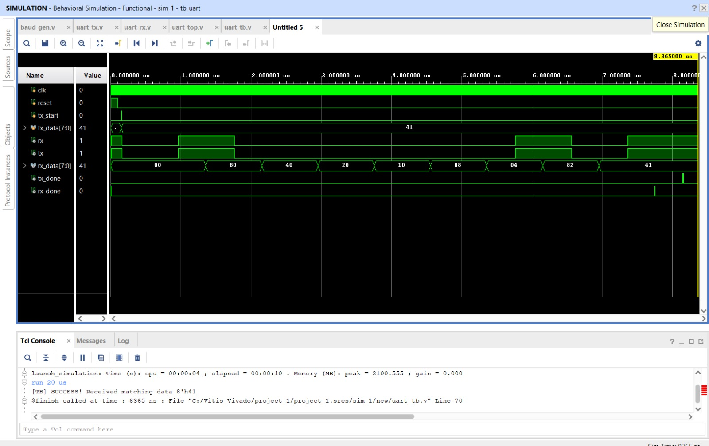

# Verilog UART Controller Core with FIFO Buffering

A modular, high-throughput, and robust UART (Universal Asynchronous Receiver-Transmitter) controller core implemented in standard Verilog. This architecture utilizes an oversampled baud rate validation scheme paired with deep FIFO memory queues to guarantee robust, data-loss-free asynchronous serialization and data recovery between independent clock domains.

## Key Features
* Modular RTL Architecture: Distinct, decoupled modules for clock tick generation (`baud_gen.v`), frame serialization (`uart_tx.v`), and frame reconstruction (`uart_rx.v`) wrapped in a single structural top-level design (`uart_top.v`).
* 16x Oversampling Clock Synchronization: The receiver sub-system utilizes a 16x clock tick macro-frequency tracker to sample incoming serial lines directly at the center of the bit duration, eliminating bit-drift and metastability.
* Integrated Hardware Queueing: Features dedicated FIFO buffering to prevent receiver overrun errors and allow continuous, back-to-back hardware transmissions at extreme data rates.

## Hardware Configuration Parameters
The testbench environment validates the system under the following standard parameters:
* System Clock Frequency: 100 MHz (Clock Period: 20 ns)
* Target Baud Rate: 1,152,000 bits per second (1.152 Mbps)
* Bit Width: 8-bit Data Frame, 1 Start Bit, 1 Stop Bit, No Parity

---

## Project Structure
* `project_1.xpr` - Native Xilinx Vivado project blueprint for single-click replication.
* `uart_top.v` - Top-level structural wrapper integrating sub-modules, state tracking, and FIFO linkages.
* `baud_gen.v` - Frequency divider generating precise 16x oversampling synchronization ticks.
* `uart_tx.v` - Finite State Machine (FSM) implementing Parallel-to-Serial packet conversion.
* `uart_rx.v` - Robust Finite State Machine implementing Serial-to-Parallel packet recovery.
* `uart_tb.v` - Self-verifying testbench exercising loopback validation channels.

---

# Verification & Simulation Results

Functional correctness was fully verified via behavioral simulation within Xilinx Vivado's simulation engine using a complete loopback topology (`assign rx = tx;`).

# Verification Waveform Dashboard

# Functional Breakdown of Simulation Timeline:
1. **Frame Initiation:** Upon asserting the transmit strobe, the serial line drops low to issue a clean, deterministic Start Bit lasting exactly 16 baud ticks (~868 ns).
2. **Serialization Vector (LSB First):** The testbench transmits data byte `8'h41` (Binary: `01000001`). Due to UART protocol specifications, serialization shifts data **Least Significant Bit first**, generating the sequential stream: `1, 0, 0, 0, 0, 0, 1, 0`.
3. **Shift-Register Reconstruction Tracking:** The receiver shift register values can be observed tracking through sequential intermediate hexadecimal states as data bits settle over the line (`80 -> 40 -> 20 -> 10 -> 08 -> 04 -> 82`) before latching onto the complete decoded frame byte of `41`.
4. **Complete Handshake:** At the exact boundary of the processed Stop Bit, both `tx_done` and `rx_done` flags successfully pulse high for exactly one single clock cycle to confirm valid domain recovery with zero bit errors.
5. **Console Output:** The automated testbench successfully outputs tracking string validation: `[TB] SUCCESS! Received matching data 8'h41`.
